# Metro-Rail Management System using C++ Object Oriented Programming
**Source Code:** [GitHub Link](https://github.com/e-h-p/Project-c-oop-.git)

## Introduction
Our Metro Rail Management System is a program that helps in managing the operations of a metro rail system. The system has two modes: **User Mode** and **Admin Mode**. 

* **User Mode:** Users can register and login to access features like viewing schedules, booking/cancelling tickets, viewing records, and managing profiles.
* **Admin Mode:** Admins can manage the fleet (add/delete trains), view user data, and update system security settings.

This project is developed using **C++ Object-Oriented Programming (OOP)** concepts and persistent file handling.

## Objectives
The main objective is to provide an efficient and easy-to-use interface for passengers to manage their travel while giving administrators the necessary tools to maintain the rail network effectively.

## Design and Implementation
The system is built using classes to ensure modularity and data encapsulation:

* **User Class:** Manages registration, authentication, and personal travel operations.
* **Admin Class:** Manages the system-wide data including trains and user databases.

### File Handling
The system uses a file-based database to store information across sessions:
* **User data:** Stores User ID, password, name, contact info, and travel history.
* **Train data:** Stores train numbers, names, routes, schedules, and seat availability.

---

## UML Diagram and Class Structure

The following diagram illustrates the relationship between the classes and the overall structure of the system:

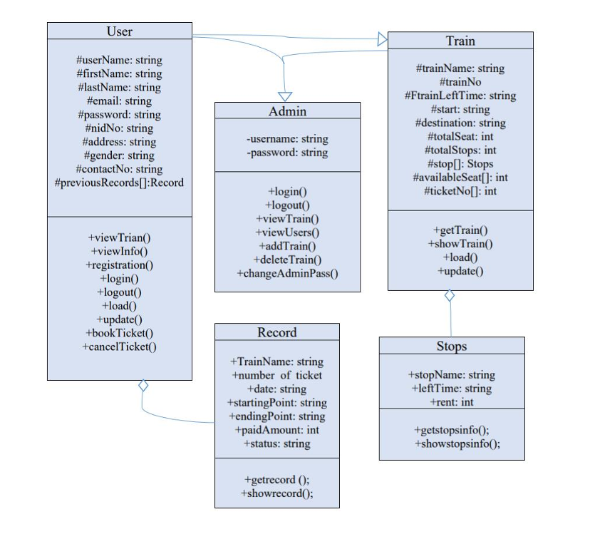

---

## Features

### 1. Main Menu
The system greets the user and provides three primary choices to navigate between User, Admin, or Exit.

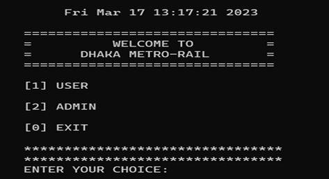

### 2. User Menu
Upon entering User Mode, the following dashboard provides access to all passenger services:

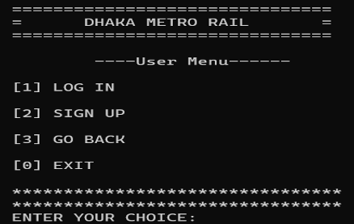

### 3. Registration
Users can register by providing essential personal information including Name, Email, NID, and Address.

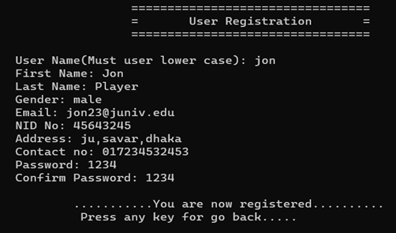

### 4. Login
Registered users can securely log in. Upon success, they are redirected to the User Dashboard.

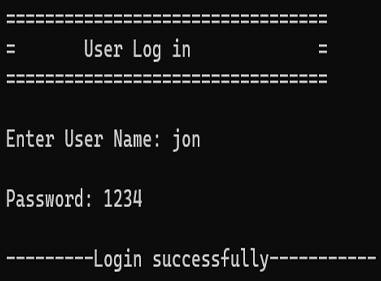
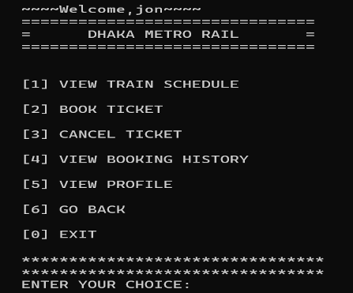

### 5. View Train Schedule
Users can view the full schedule including source and destination.

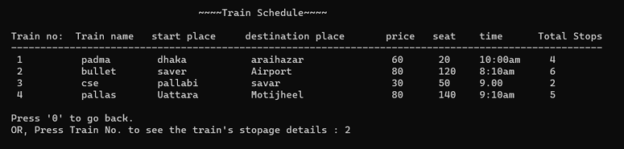

**Stoppage Details:** Users can select a specific Train No. to see detailed stop points, the rent to each stop, and available seat counts for each segment.

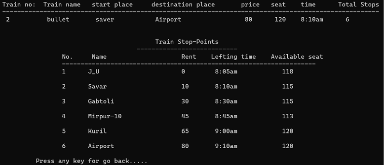

### 6. Book Ticket
Users can book seats by selecting their route. The system calculates the fare and generates a unique **Ticket ID** upon confirmation.

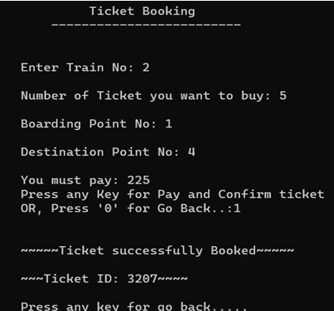

### 7. Cancel Ticket
Users have the option to cancel a previously booked ticket by providing the specific Ticket ID.

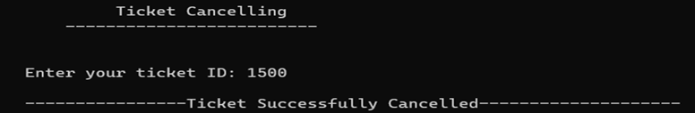

### 8. View Previous Records (Booking History)
Users can track their travel history, including past trips and Ticket IDs.

### 9. View Profile
Users can review their registration details such as email, NID, and contact information.

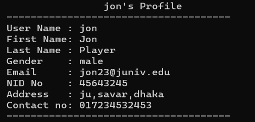

---

## Admin Mode

### 1. Admin Login
Secure access for administrators via a master password.

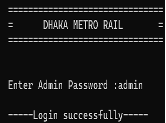

### 2. Admin Dashboard
The admin has access to powerful management tools to oversee the entire system.

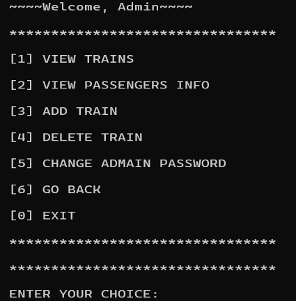

### 3. Add Train
Admins can expand the fleet by entering train names, total seats, stops, and departure times for specific stops.

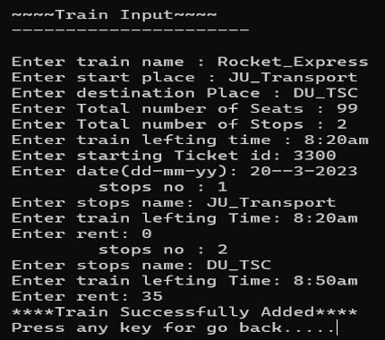

### 4. Delete Train
If a train service is discontinued, the admin can remove it from the database by entering the Train Name.

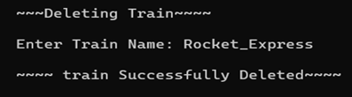

### 5. View Users
Admins can monitor the system by viewing a list of all registered users and their full booking history.

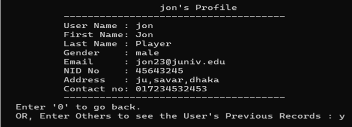
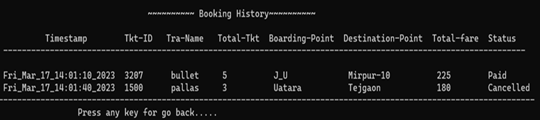

### 6. Change Admin Password
For security maintenance, the admin can update the system's access password at any time.

---

## Conclusion
The Metro Rail Management System is a comprehensive, user-friendly solution developed using C++ OOP principles. By leveraging file handling for a persistent database, it provides a reliable environment for passengers to manage their travels and for administrators to maintain the rail network efficiently.